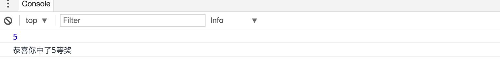

由于最近公司有提出抽奖的需求，搞了个简易的九宫格抽奖demo，该demo由于后台接口属于公司机密，我这里就搞了点静态图 和 随机数做抽奖概率（在前端做概率统计的话，很容易被劫持，还是后台返回给中奖位置比较安全）。

先几张效果图：

简单的实现了抽奖的过程（分享到朋友圈 和 用户生成订单并确认付款均会增加抽奖次数，由于需要后台支持，这里并没有给出那部分code）。

这里用的是es6 + jq的形式做的（如果对es6不熟，[猛烈点击](http://es6.ruanyifeng.com/)），在代码内做了相关的注解，这里只列出基本的变量：
    
`    this.count = 0; //位置总数
    this.speed = 10; //初始速度
	this.timer = 0; //定时器时间
	this.currentIndex = -1; //转动的当前位置
	this.rotateNum = 0; //转动次数
	this.basicCycle = 50; //运动初始次数
	this.prizePlace = -1; //中奖位置
	this.isClick = false; //是否重复点击抽奖
	this.parentDom = null; //根dom
	this.initOppo = 2; //初始抽奖次数
`
	

如果感觉对你有帮助，请给个star			

